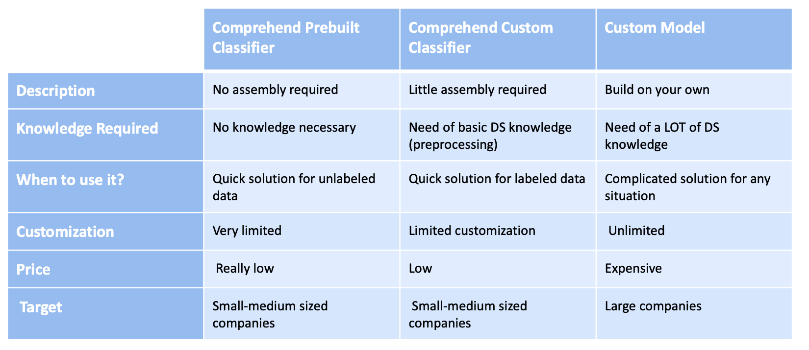

# Amazon E-Commerce NLP Project

## Project Overview

Amazon receives millions of reviews on all of their listed products. It would be useful for Amazon product owners to quickly know negative product reviews about their products. Not only would it be helpful to correctly classify negative reviews, but we also want to understand why the reviews are negative. This way product owners can take steps to rectify issues as they arise which would increase customer satisfaction and generate additional revenue. 

## Using Logistic Regression for Text Classification:

1) Dataset used: **Amazon Reviews: Polarity** which can be found in https://course.fast.ai/datasets (the notebook downloads this automatically)  
    * There are 3 columns in the train/test data, corresponding to class index (1 or 2), review title, and review text. Class 1 corresponds to a negative classification and class 2 to a positive classification. Each class has 1,800,000 training samples and 200,000 testing samples. 
2) EDA
   * Generate word cloud
3) Data preprocessing:  
    * Normalize Feature text
    * Vectorize text   
4) Modeling:
    * Logistic Regression
    * LSTM
5) Extracting feature importance
   * Top 10 words for positive and negative sentiments

## Using Gensim for Topic Modeling:

1) Import relevant **Amazon Reviews: Polarity** data
2) Basic EDA
3) Data preprocessing:  
    * Normalize text
    * Create the document term matrix 
4) Modeling:
    * Latent Dirichlet Allocation (LDA)
5) Iteration
   * Trying different combinations of Parts of Speech (Nouns vs Nouns and Adjectives)

## Using AWS Comprehend for Text Classification:

1) Upload data to an S3 bucket
2) Upload the notebook to SageMaker
3) Use Amazon Comprehend to classify text

The notebook is divided into two sections, both with the objective of classifying text sentiment:

    a) Use the prebuilt model that Amazon Comprehend provides.
    Accuracy over sampled data: 81.64%

    b) Train a custom classifier with Amazon Comprehend tool. Used 990,000 reviews for training and 1000 for testing (max)
    Accuracy: 93.37%

There is a clear interest in building a custom model, since there is a significant improvement in accuracy.
  

## Run the notebooks:
### Option 1: Run the notebooks and download all the missing packages manually
Running NLP_for_Customer_Reviews.ipynb:  
execute command: `jupyter notebook NLP_for_Customer_Reviews.ipynb`  
Running Topic_Modeling.ipynb:  
execute command: `jupyter notebook Topic_Modeling.ipynb`  
### Option 2: Create a virtual environment and download only the necessary packages
1) Clone the repository with:  `https://github.com/RahulReady/Amazon-ecommerce-NLP.git`
2) Navigate into the repo and create a virtual environment with:  `python3 -m venv <addVenvNamehere>`
3) Activate the virtual environment:  
On <ins>Windows</ins>, run: 
    `<addVenvNamehere>\Scripts\activate.bat`
 On <ins>Unix or MacOS</ins>, run:  
    `source <addVenvNamehere>/bin/activate`
4) Install the requirements with:  `pip install -r requirements.txt`
4) Open the jupyter notebooks and change the kernal to the newly created virtual environment to run the code.  

## Quick comparison of tools used in the project

## Conclusions

*When should you use Comprehend?*

As always, it all comes down to achieving the best quality/cost ratio.

Large companies that have resources and need specific solutions that offer additional insights will prefer custom models. On the other hand, small-medimum sized companies that will prioritize speed and ease of use, will prefer AWS Comprehend, which provides a simpler way to getting an out-of-the-box approach to work on text classification.

As a reference, we estimated that the cost of running sentiment analysis over 50M requests with the prebuilt model (over samples of ~1000 characters) would be around $11K. Substantially less than hiring a team of data scientists in the US. [Source](https://aws.amazon.com/comprehend/pricing/)

Furthermore, the use of Amazon Comprehend offers additional benefits:

* It's easy to integrate in any type of apps
* You have the possibility of combining it with other AWS services, since the tool is embedded into the AWS infrastructure
* You don't have to worry about scalability

 

 

*Note*: Original Problem Statement: https://github.com/aws-samples/amazon-sagemaker-architecting-for-ml/blob/master/Writeups/NLP:%20Text%20Classification.md
